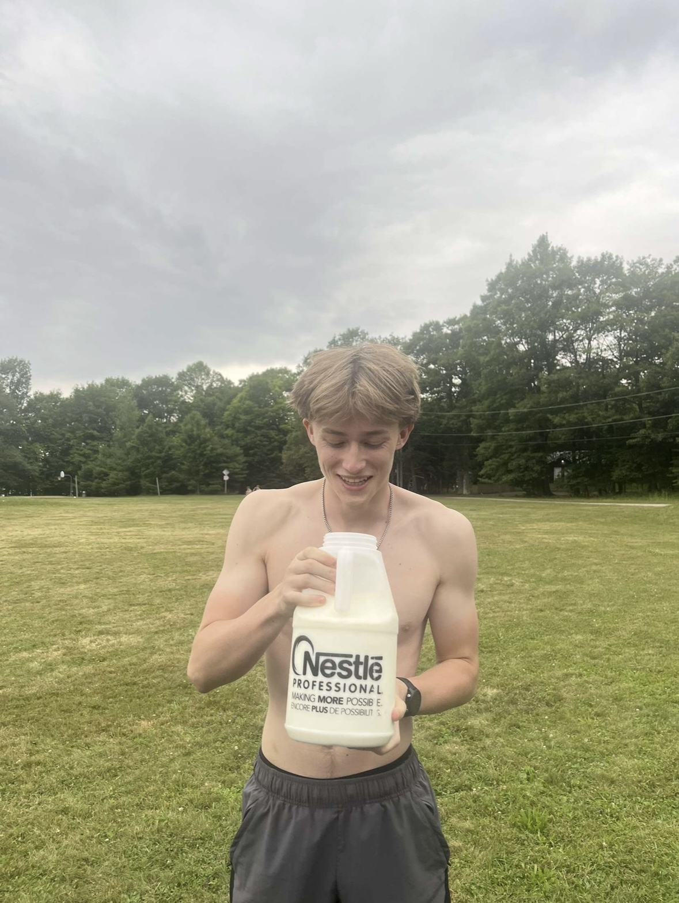
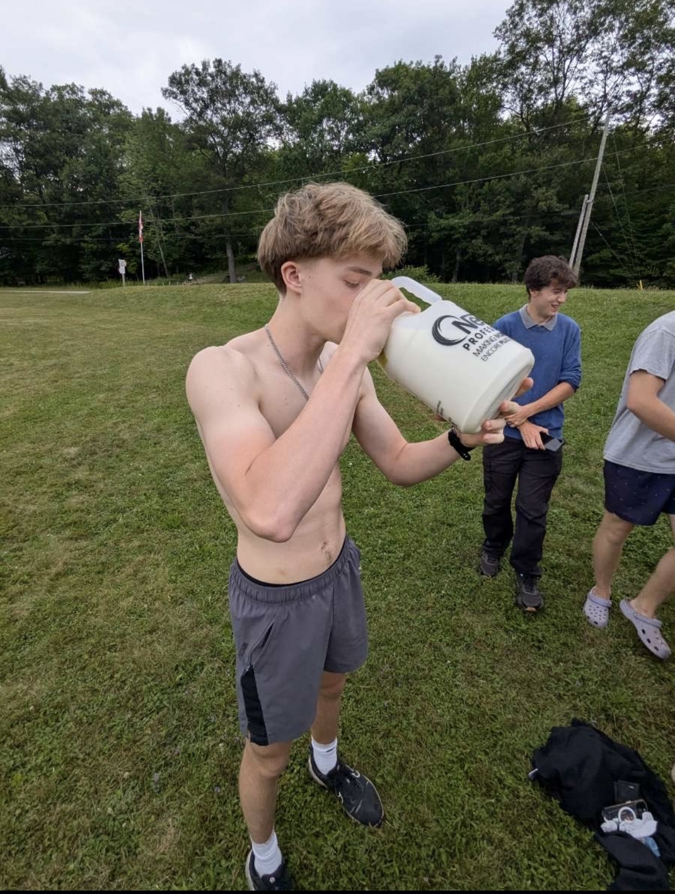

## About
This project analyzes and predicts NFL quarterback performance by combining quarterback statistics with defensive matchup data. The system uses historical data and current season information to forecast how QBs will perform against specific defenses in the 2025 season.

## Why this project
As an avid sports lover, over the last few years I’ve gotten really into fantasy football, soccer, and basketball. Fantasy means a lot to me considering every year there is money and a brutal punishment for the loser on the line. Last year, I lost my fantasy football league and had to run a milk mile as punishment (The milk mile is a challenge where you drink a gallon of milk and then run a mile):

  
  
  

I didn’t want that to happen again, so I built a tool to help me decide which quarterbacks to draft and start each week this year. While my tool isn’t totally accurate, it gave me useful insights into what stats and predictors can actually signal whether a quarterback will play well.

## Website Visual

I created a simple website displaying the predictions my model made. 
- The first page displays a list of all the 2025 QBs ranked by my model's predicted fantasy points for that player. Here you can select QBs that you want to compare to get a week by week view of who my model predicted to play better each week. 
- The second page displays the comparisons week by week with a player summary at the bottom.

## Dataset 
This project uses quarterback game logs and defensive matchup stats.  
- **Quarterback stats:** collected from Pro-Football-Reference.com  
- **Defense vs QB stats:** also from Pro-Football-Reference.com (covering the 2022–2024 seasons)  
- **2025 NFL Schedule:** scraped from [ESPN](https://www.espn.com/nfl/schedulegrid)  
These datasets were cleaned and combined to create inputs for the model.  

## Model limitations
Predicting fantasy football is very hard. Player performance is impacted by a lot of unpredictable factors like injuries, coaching and weather. Additionally, team rosters change a lot in football, so using data from last year to predict the next year doesn’t always give accurate results. On top of that, quarterbacks can have big swings from week to week when they have off games, which makes accurate predictions even harder.

## How to clone/build/run
1. Clone the repository:
`git clone https://github.com/<your-username>/ML-Fantasy-QB-Predictor.git`
2. Navigate to the project directory:
`cd ML-Fantasy-QB-Predictor`
3. Install dependencies:
`pip install -r requirements.txt`
4. Run the Flask app:
`python src/app.py`
5. Open your browser and go to:
`http://localhost:5000`

## Development
This project is built with:
- Python
- Flask
- Pandas
- Xgboost
- scikit-learn
- NumPy
- HTML/CSS

